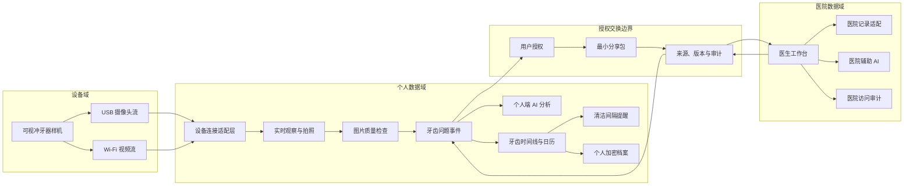

# 总体系统架构

版本：0.1  
状态：阶段 0 已确认

## 1. 架构目标

系统需要同时支持：

- USB 样机真实实时画面；
- Wi‑Fi 样机实时画面与后续接入；
- iOS 拍照和本地体验；
- 长期牙齿档案；
- AI 图片报告；
- 医生图片咨询；
- 未来医院协作；
- 数据来源、版本、授权和审计。

系统采用“个人域＋授权交换边界＋医院域”的双域架构。首个 Demo 先实现个人域和演示咨询流程。

## 2. 总体结构



## 3. 个人域模块

### 3.1 设备连接适配层

职责：

- 隔离 USB 标准摄像头接口、Wi‑Fi 视频协议和厂商 SDK 差异；
- 发现、连接和断开设备；
- 接收视频帧；
- 报告连接、网络和流状态；
- 支持断线重连；
- 为未来硬件版本提供统一接口。

该模块在确认实际协议前保持协议无关。

### 3.2 实时观察与拍照

职责：

- 建立一次可恢复的观察会话；
- 实时画面；
- 拍照和冻结帧；
- 拍摄指导；
- 选择牙齿及区域；
- 将设备和拍摄元数据写入事件；
- 只有用户确认完成后才建立清洁会话，连接或拍照本身不代表完成清洁。

### 3.3 图片质量检查

职责：

- 模糊；
- 过暗或过曝；
- 反光；
- 水滴和遮挡；
- 牙齿占比；
- 是否适合对比或 AI 查看。

质量不合格时不得静默进入后续分析。

### 3.4 牙齿问题事件

它是系统最重要的稳定容器，贯穿：

```text
照片
→ 牙齿和区域
→ 用户问题
→ AI 报告
→ 用户确认
→ 医生咨询
→ 补拍
→ 复查
→ 完成或重新打开
```

每次页面切换、网络重试和 App 恢复都必须继续使用同一事件身份。

结构上需要区分：

- `DentalCase`：一件持续处理的问题，身份长期稳定；
- `DentalEvent`：该问题中的拍摄、AI 报告、咨询、补拍、复查等单次活动；
- `ObservationSession`：一次设备连接和连续观察过程；
- `CleaningSession`：一次经用户确认完成的清洁记录。

这样既能保持“一个问题事件”的连续性，也不会把连接设备、拍摄、清洁和医生回复混成同一种记录。

### 3.5 个人端 AI

职责：

- 图片质量；
- 牙齿和区域定位；
- 同牙同区域匹配；
- 疑似食物残留或可见变化候选；
- 历史图片对比；
- 蛀牙、牙龈发炎、肿胀、牙结石等可见特征的基础疾病初筛；
- 结构化报告；
- 问题整理。

个人端 AI 可以给出清楚的初筛类别，但不把结果写成“已经确诊”，也不写入医院确认记录。

### 3.6 个人加密档案

首个 Demo：

- iPhone 本地加密保存；
- 缩略图与原图分层；
- 导出和删除；
- App 重启恢复事件。

正式产品：

- 用户私有加密备份；
- 换机恢复；
- 跨设备冲突处理；
- 大规模历史媒体归档。

### 3.7 清洁间隔提醒

提醒模块读取最近一次有效的 `CleaningSession`，并结合用户偏好计算下一次提醒时间。

边界：

- 设备连接、拍照或查看历史不等于完成清洁；
- 用户补记与设备生成的清洁完成记录都可更新最近清洁时间；
- 记录被删除或更正后重新计算提醒；
- 计算逻辑不读取 AI 疾病初筛结果，不把间隔转换为健康风险；
- 通知正文不包含照片、牙齿问题或其他敏感详情；
- 用户可关闭、暂停或调整提醒，不设置强制频率。

## 4. 授权交换边界

用户向医生发送的不是整个个人档案，而是一个可预览的最小分享包：

```text
当前问题
+ 当前照片
+ 当前牙齿和区域
+ 用户主动选择的历史照片
+ 可选 AI 报告
+ 必要的用户备注
```

每个分享包需要：

- 分享目的；
- 接收方；
- 数据范围；
- 创建时间；
- 有效状态；
- 撤回状态；
- 来源和版本。

## 5. 医院域

首期只设计接口和演示工作流，不连接生产系统。

长期模块：

- 医生工作台；
- 患者授权资料查看；
- 医生回复与图片标记；
- 医院确认记录；
- 医院文件或摘要导入；
- 医院授权样本的去标识、标注、质检与版本管理；
- 独立的模型训练、验证和发布评估区；
- 权限和访问审计；
- 医院内部模型验证。

医院原始记录与个人端授权副本保持不同身份和来源。

医院提供的样本不能直接进入线上模型；必须先经过授权范围确认、去标识、标注质量检查、数据版本冻结和独立评估。

## 6. 关键数据流

### 6.1 拍照到 AI 报告

```text
视频帧
→ 用户拍照
→ 图片质量检查
→ 用户确认牙齿与区域
→ 创建或追加 DentalCase
→ 追加拍摄 DentalEvent
→ 创建可重试的 AIAnalysisJob
→ 生成带模型版本的报告
→ 用户确认或否定
→ 追加报告 DentalEvent 并写入牙齿时间线
```

### 6.2 AI 报告到医生咨询

```text
当前事件
→ 用户选择“请医生查看”
→ 预览分享内容
→ 创建分享包
→ 医生接收
→ 医生查看原始照片和用户问题
→ 回复或请求补拍
→ 回写医院确认记录
→ 更新原事件状态
→ 日历显示完整过程
```

### 6.3 历史对比

```text
选择当前照片
→ 确认牙齿身份
→ 确认牙面区域
→ 筛选质量合格历史照片
→ 计算可比性
→ 可比：展示差异
→ 不可比：说明原因，不生成变化结论
```

## 7. 系统状态原则

- 所有创建请求使用稳定事件标识，避免重复；
- 异步任务可以重试，但不能重复产生业务结果；
- 新 AI 模型生成新报告版本，不覆盖旧结果；
- 医院更正生成新版本，不改写历史；
- 删除证据后，依赖该证据的分析进入失效状态；
- 不能确定牙齿身份时，等待用户确认；
- App 退出、网络中断和设备断线均可恢复。

## 8. 首个 Demo 部署边界

首个 Demo 只需要：

- 一台真实 USB 摄像头样机；
- 一台能识别该摄像头的演示电脑；
- 本地 HTML 演示页面；
- 本地事件与档案；
- 可替换的 AI 分析接口；
- 演示医生账号和咨询队列。

Wi‑Fi 样机和 iOS 原生连接作为下一阶段接入目标保留，不影响当前 USB 现场演示。

不需要：

- 医院生产网络；
- 多医院；
- Android；
- 正式临床模型；
- 大规模云服务。
